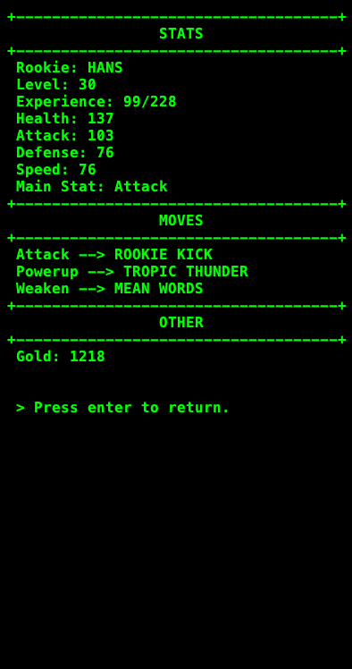
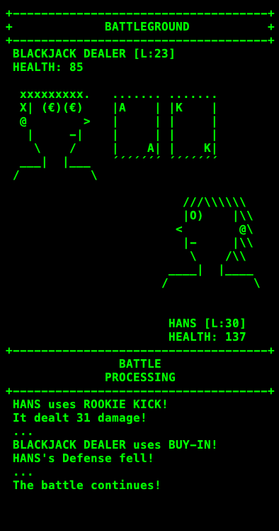
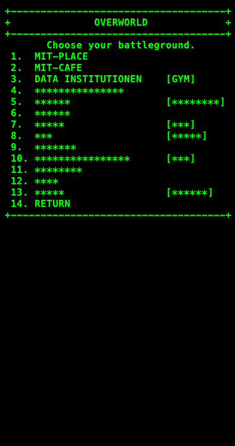

# Rookie Revenge
Rookie Revenge RPG is a completely string-based, turn-based RPG game made in Java. Set in an environment based on locations from [Umeå, Sweden], the game allows players to recruit and level up unique characters known as 'Rookies'. Explore various battlegrounds, engage in strategic battles to gain rewards and defeat the evil entities called "Pirayas".



## Features
* **Turn Based Combat:** A logic-driven battle system featuring standard attacks, stat modifiers (Powerup/Weaken), dodging and critical hits.
* **Dynamic World:** Includes unique battlegrounds based on locations from [Umeå, Sweden], each with specific enemies and difficulty scaling.
* **Progression System:** Players can level up their Rookies, learn new abilities from a move catalog, and accumulate gold through victories.
* **Save & Load System:** Features built-in persistence to save and resume game progress via serialized data handling.

## Patch Notes
* **V0.5-beta:** Initial game finished, beta ready for improvement.
* **V0.1-V0.4-alpha:** Initial Game buildup. New battlegrounds, enemies, moves, store/training added every version


## Project Structure
```
Rookie-Revenge-RPG/
├── src/                    # Source code
│   ├── core/               # Engine and main logic (GameManager, GameData)
│   │   └── handlers/       # Logic for specific states (Battle, Menu, Overview)
│   ├── model/              # Data models (Player, Rookie, Battleground)
│   │   └── moves/          # Move system (AttackMove, EffectMove)
│   ├── resources/          # Text strings and ASCII art assets
│   ├── utils/              # Utility classes (StringReader, SaveManager)
│   └── App.java            # Main entry point
├── archive/                # Legacy versions
├── assets/                 # Asset folder
└── RRRPG.jar               # Latest playable version
```

## Getting Started
### Prerequisites
- Java Development Kit (JDK) 8 or higher

### Installation
1. Download a release RR-RPG file.
2. Open your terminal and navigate to the directory containing the downloaded file.
3. Run the application using the following command:
```
java -jar RR-RPG.jar
```
